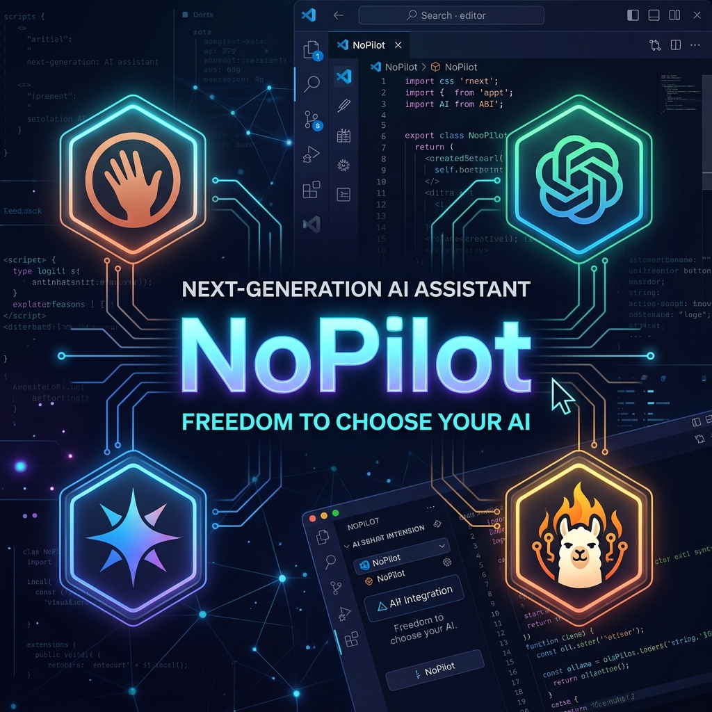

  

  ### 🎮 Unity Game Developer | 🤖 AI Integrator | 💡 Creative Coder

  

    
  

  

    <i>Passionate about building engaging games, exploring the limits of AI integrations (MCP, Jules), and creating smart developer tools. Always learning, always coding.</i>
  

 

  <table>
    <tr>
      <td width="320" align="center" style="border: none;">
        
      </td>
      <td style="border: none;">
        <h3>🚀 NoPilot: Next-Gen AI Assistant</h3>
        
<i>The multi-provider AI coding assistant that gives you the freedom to choose your LLM.</i>

        

          
          
        

        
Support for <b>Claude 3.5, GPT-4o, Gemini 2.0</b>, and local <b>Ollama</b> models with ultra-fast caching and deep workspace context.

        
      </td>
    </tr>
  </table>

 

## 🛠️ Tech Stack & Tools

  

 

## 📊 GitHub Stats

  
  

 

## 📌 Pinned Repositories

  
  
   
   
  
  
   
   
  
  

 

## 📫 Let's Connect!

- **Portfolio/Blog:** [Hanjo92.github.io](https://Hanjo92.github.io)
- **Contact:** `[gooldare@naver.com/
  - https://www.linkedin.com/in/%EC%8A%B9%ED%9B%84-%EC%86%A1-04062a19b/]`

  

